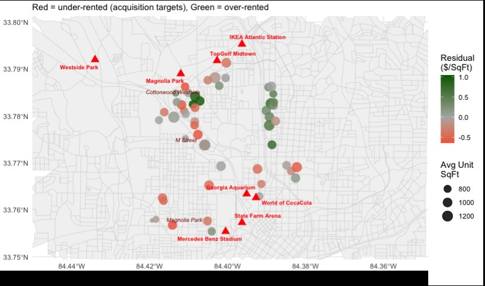

# rent-model

Interactive LASSO regression pipeline for identifying undervalued multifamily rental properties. Point it at any Yardi Matrix CSV export and it walks you through selecting a submarket, features, and landmarks — then runs the full analysis.

<p align="center">
  
  <br>
  <em>Example output — properties colored by model residual (red = under-rented acquisition targets)</em>
</p>

## Quick Start

```bash
pip install numpy pandas scikit-learn pyyaml matplotlib

# Optional: for census block map backgrounds
pip install geopandas

# Run interactively
python run_analysis.py
```

The CLI will prompt you for:

1. **CSV path** — your Yardi Matrix data export
2. **Submarket** — auto-detects the column and lists available submarkets
3. **Column mapping** — auto-detects common column names (PropertyID, Latitude, etc.)
4. **Features** — auto-classifies columns as binary, numeric, or categorical; you pick which to include
5. **Landmarks** — enter name + lat/lon for local amenities (distances computed via Haversine)
6. **Model settings** — CV folds, number of targets
7. **Map background** — optional state/county FIPS for census block outlines

At the end, you can **save your config as YAML** and rerun without prompts:

```bash
python run_analysis.py --config my_saved_config.yaml
```

## What It Does

1. Filters to your target submarket
2. Engineers features: distances to landmarks, binary amenity encoding, categorical dummies, computed variables (rent/sqft, parking/unit)
3. Runs cross-validated LASSO with automatic variable selection
4. Ranks variable importance via partial R² (drop-one analysis)
5. Identifies acquisition targets — properties charging well below model-predicted rent
6. Generates a map with properties colored by residual and labeled landmarks

## Output

All saved to `output/`:

| File | Description |
|------|-------------|
| `results.csv` | Every property with predicted rent, residual, % below market |
| `variable_importance.csv` | Non-zero LASSO coefficients ranked by partial R² |
| `acquisition_targets.csv` | Top N most under-rented properties |
| `submarket_map.png` | Scatter map (with optional census block grid) |

## Project Structure

```
rent-model/
├── run_analysis.py    # Main pipeline + interactive CLI
├── utils.py           # Haversine, encoding, imputation, column classification
└── README.md
```

## Requirements

- Python 3.8+
- numpy, pandas, scikit-learn, pyyaml, matplotlib
- geopandas (optional — enables census block map background)

## How It Works

The model predicts **rent per square foot** as a function of building attributes, amenities, utility structures, and distances to local landmarks. LASSO regularization (L1 penalty) performs automatic variable selection, shrinking irrelevant coefficients to zero.

**Acquisition targets** are properties with the most negative residuals — they charge significantly less than the model predicts given their attributes. This flags potential upside under repositioning, though site-level diligence is always required.

**Variable importance** uses partial R²: for each selected variable, the model is refit without it, and the drop in R² measures that variable's unique contribution.

## License

MIT
